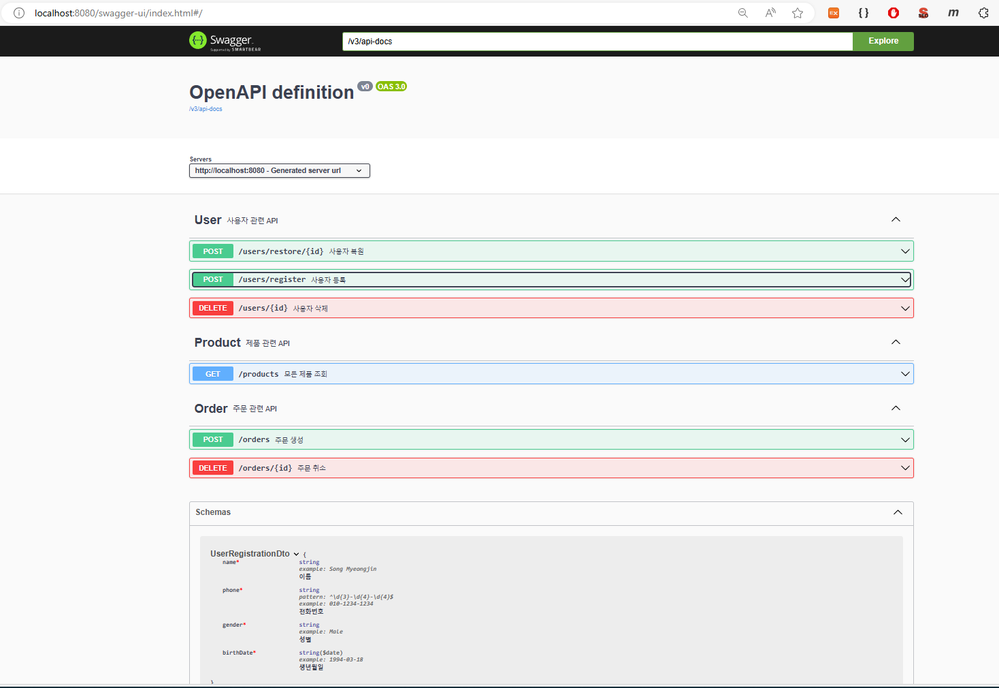
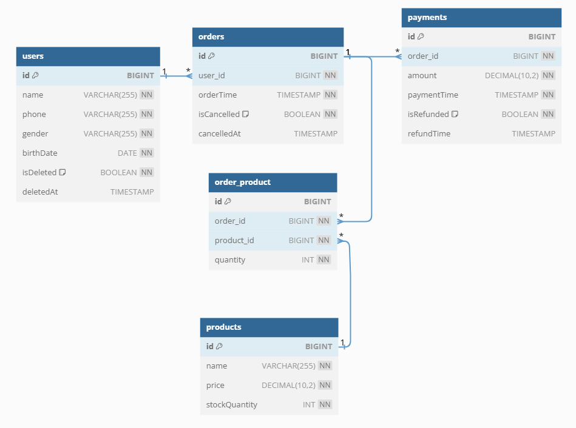

# 프로젝트 설명

이 프로젝트는 카페 주문 관리 시스템입니다. 

사용자들은 제품을 주문할 수 있으며, 주문된 제품에 대해 결제가 이루어집니다.

## 기술 스택

- **Java 17**
- **Spring Boot 3.3.0**
- **H2 Database**

# 서비스 실행 방법 
1. root 폴더 경로에서 하기 명령어를 실행하여 서비스를 실행시켜주세요.
    ```
    $ java -jar cafe-0.0.1.jar  
    ```
2. Swagger를 사용하시거나, 혹은 intellij라면, http/integrated.test.http의 http client를 이용하여 테스트 가능합니다.
   ```
   ### 1. 유저 생성 샘플 
   POST http://localhost:8080/users/register
   Content-Type: application/json
      
   {
   "name": "Song Myeongjin",
   "phone": "010-1234-1232",
   "gender": "Male",
   "birthDate": "1994-03-18"
   }
   ```

# API 명세서 (Swagger)

Swagger-ui를 사용하여, API 명세서를 제공하고 있습니다.

## 진행 방법

1. 커맨드라인에서 서비스를 실행한다.
2. http://localhost:8080/swagger-ui/index.html 로 들어가서 Swagger를 사용합니다.

   

# 데이터베이스 ERD 설명

이 프로젝트의 데이터베이스는 다음과 같은 테이블들로 구성되어있으며, 각 테이블과 그 관계는 아래 설명을 참고해주세요.

## 테이블 설명

- **User**: 사용자 정보 테이블
- **Product**: 제품 정보 테이블
- **Order**: 사용자의 주문 정보 테이블
- **OrderProduct**: 주문과 제품 간의 중간테이블로, 다대다 관계를 저장
- **Payment**: 결제 정보 테이블

## 테이블 간의 관계

| 테이블 A   | 테이블 B        | 관계    |
|---------|--------------|-------|
| User    | Order        | 1 : N |
| Order   | OrderProduct | 1 : N |
| Product | OrderProduct | 1 : N |       
| Order   | Payment      | 1 : 1 |

- **User와 Order**: 한 명의 사용자는 여러 개의 주문을 할 수 있습니다.
- **Order와 OrderProduct**: 하나의 주문은 여러 개의 제품을 포함할 수 있습니다.
- **Product와 OrderProduct**: 하나의 제품은 여러 주문에 포함될 수 있습니다.
- **Order와 Payment**: 하나의 주문은 하나의 결제 정보를 가집니다.

## ERD 다이어그램


